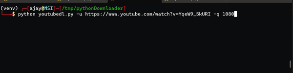

# youtubedl : Youtube Video Downloder 

* `youtubedl.py` : Download youtube videos by using pytube library.  
* Dependency : required ffmpeg binary to convert file into mp3 audio.  

## Installation : 

Install ffmpeg binary in your linux system.  

```
sudo apt install ffmpeg -y
```  

Install required libraries 

```
pip3 install -r requirements.txt 
```  

## Usage : 

```
$ python ./youtubedl.py

usage: youtubedl.py [-h] [-u URL] [-q QUALITY] [-a]

optional arguments:
  -h, --help            show this help message and exit
  -u URL, --url URL     Youtube video url
  -q QUALITY, --quality QUALITY
                        Video Quality [1080|720|360|240|144] Default:1080
  -a, --audio           Convert to mp3
```  

__Download Video file :__  



__Download Audio file :__  


